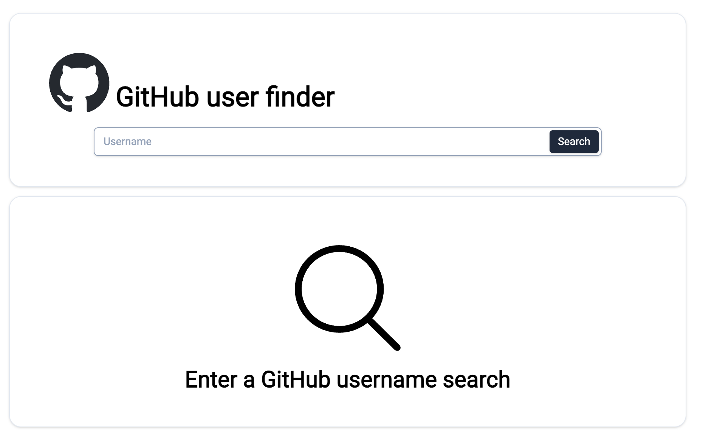

# GitHub User Finder

A small React app used in the "Principles of Web Development (ATA)" course to search and view basic GitHub profile information.

## Features

- Search GitHub users by username
- Show avatar, name, bio, location, followers, following, and basic repo list
- Responsive, component-driven UI
- Simple client-side error handling and loading states

## Tech

- React
- Axios for requests
- TailwindCSS

## Quickstart

1. Clone:

```
   git clone https://github.com/rybmks/ATA-github-user-finder
```

2. Install:

### Locally:

```
   cd github-user-finder
   npm install
```

3. Run:

```
   npm run dev
```

### With Docker:

```
   cd github-user-finder
   docker compose up --build
```

Opens at http://localhost:5173

## UI Examples



